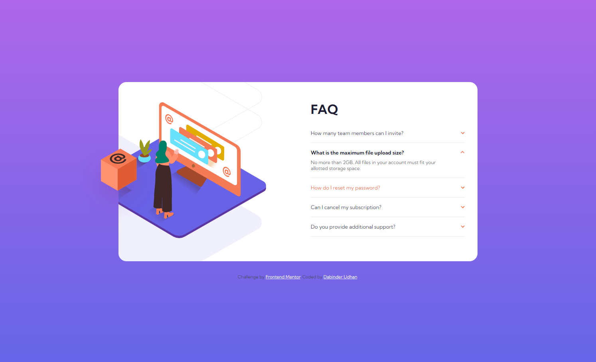

# Frontend Mentor - FAQ accordion card solution

This is a solution to the [FAQ accordion card challenge on Frontend Mentor](https://www.frontendmentor.io/challenges/faq-accordion-card-XlyjD0Oam). Frontend Mentor challenges help you improve your coding skills by building realistic projects.

## Table of contents

- [Overview](#overview)
  - [The challenge](#the-challenge)
  - [Screenshot](#screenshot)
  - [Links](#links)
- [My process](#my-process)
  - [Built with](#built-with)
  - [What I learned](#what-i-learned)
  - [Continued development](#continued-development)
  - [Useful resources](#useful-resources)
- [Author](#author)
- [Acknowledgments](#acknowledgments)

**Note: Delete this note and update the table of contents based on what sections you keep.**

## Overview

### The challenge

Users should be able to:

- View the optimal layout for the component depending on their device's screen size
- See hover states for all interactive elements on the page
- Hide/Show the answer to a question when the question is clicked

### Screenshot




### Links

- Solution URL: [Github](https://github.com/dabinderudhan/FAQ-accordion-card)
- Live Site URL: [live URL](https://dabinderudhan.github.io/FAQ-accordion-card/)

## My process

### Built with

- Semantic HTML5 markup
- CSS custom properties
- Flexbox
- CSS Grid
- Mobile-first workflow
- JavaScript

### What I learned

solving this challenge I learnt about the different CSS properties about background and object-position property.

To see how you can add code snippets, see below:

```css
.proud-of-this-css {
  background-image: url("../images/bg-pattern-desktop.svg");
  background-size: 180%;
  background-repeat: no-repeat;
  background-position: right 90px bottom -130px;
}
```

## Author

- Website - [Github profile](https://github.com/dabinderudhan)
- Frontend Mentor - [@dabinderudhan](https://www.frontendmentor.io/profile/dabinderudhan)
- Twitter - [@dabinderudhan](https://twitter.com/dabinderudhan)
